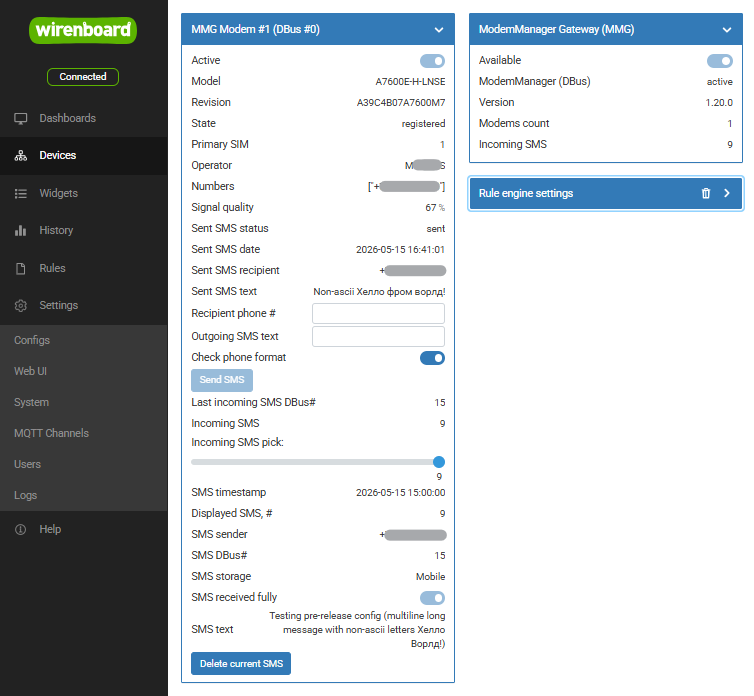

# wb-mm-mqtt

`wb-mm-mqtt` is a Rust daemon that bridges ModemManager to WirenBoard MQTT.

It:
- publishes ModemManager state as WirenBoard MQTT devices and controls;
- shows modem information and incoming SMS messages in the WB UI;
- lets users browse and delete incoming SMS messages;
- can optionally enable outgoing SMS controls with `--allow-outgoing-sms`.



## Build for WirenBoard

This project is configured for the `armv7-unknown-linux-gnueabi` target and
expects the `arm-linux-gnueabi-gcc` cross-linker.

Build a release binary:

```bash
cargo build --release --target armv7-unknown-linux-gnueabi
```

The resulting binary will be placed at:

```bash
target/armv7-unknown-linux-gnueabi/release/wb-mm-mqtt
```

## Run

By default the daemon connects to the local system DBus and the local MQTT
broker. Useful options:

```bash
wb-mm-mqtt --help
wb-mm-mqtt --log-level debug
wb-mm-mqtt --allow-outgoing-sms
```

## Event Handling Notes

For user scripts and automations:

- Check ModemManager `is_available` before trusting any MQTT data. This is
  intentionally used as a safety marker in case the daemon terminates
  unexpectedly and cannot clean up MQTT topics gracefully.
- Check modem `is_active` before using modem-specific data. If the modem is not
  active, SMS state and other modem data should be treated as stale.
- Track changes of `last_received_sms_dbus_id` to detect newly received SMS
  messages.

Incoming SMS messages can be viewed in the WB UI and deleted from there after
processing.
