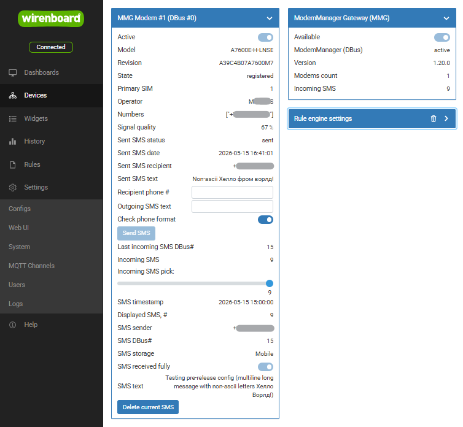

# wb-mm-mqtt

`wb-mm-mqtt` is a Rust daemon that bridges ModemManager to WirenBoard MQTT.

It:
- publishes ModemManager state as WirenBoard MQTT devices and controls;
- shows modem information and incoming SMS messages in the WB UI;
- lets users browse and delete incoming SMS messages;
- can optionally enable outgoing SMS controls with `--allow-outgoing-sms`.



## Build for WirenBoard

This project is configured for the `armv7-unknown-linux-gnueabi` target and
expects the `arm-linux-gnueabi-gcc` cross-linker.

Build a release binary:

```bash
cargo build --release --target armv7-unknown-linux-gnueabi
```

The resulting binary will be placed at:

```bash
target/armv7-unknown-linux-gnueabi/release/wb-mm-mqtt
```

## Run

By default the daemon connects to the local system DBus and the local MQTT
broker. Useful options:

```bash
wb-mm-mqtt --help
wb-mm-mqtt --config /etc/wb-mm-mqtt.conf
wb-mm-mqtt --log-level debug
wb-mm-mqtt --allow-outgoing-sms
```

## Configuration file

The daemon may optionally read a JSON config file from
`/etc/wb-mm-mqtt.conf`. At the moment it supports two settings:

- `logLevel`
- `allowOutgoingSms`

Example:

```json
{
  "logLevel": "info",
  "allowOutgoingSms": false
}
```

CLI flags still win over file settings. For example, `--log-level debug` and
`--allow-outgoing-sms` override values from the config file.

## Run as a systemd service

To run the daemon permanently on a WirenBoard controller:

1. Copy the binary to a permanent location, for example:

```bash
mkdir -p /opt/wb-mm-mqtt
cp target/armv7-unknown-linux-gnueabi/release/wb-mm-mqtt /opt/wb-mm-mqtt/
```

2. Create `/etc/systemd/system/wb-mm-mqtt.service` with contents similar to:

```ini
[Unit]
Description=DBus ModemManager - MQTT WirenBoard Gateway
After=dbus.socket

[Service]
ExecStart=/opt/wb-mm-mqtt/wb-mm-mqtt

[Install]
WantedBy=multi-user.target
```

3. Reload systemd after creating or editing the unit:

```bash
systemctl daemon-reload
```

4. Start the service:

```bash
service wb-mm-mqtt start
```

5. Enable autostart and start it immediately:

```bash
systemctl enable --now wb-mm-mqtt
```

6. Watch live logs:

```bash
journalctl -feu wb-mm-mqtt
```

If you need custom CLI flags, add them to the `ExecStart=` line, for example:

```ini
ExecStart=/opt/wb-mm-mqtt/wb-mm-mqtt --config /etc/wb-mm-mqtt.conf
```

An example WirenBoard JSON-editor schema and example config file are provided
in `contrib/wb-mqtt-confed/`.

## Event Handling Notes

For user scripts and automations:

- Check ModemManager `is_available` before trusting any MQTT data. This is
  intentionally used as a safety marker in case the daemon terminates
  unexpectedly and cannot clean up MQTT topics gracefully.
- Check modem `is_active` before using modem-specific data. If the modem is not
  active, SMS state and other modem data should be treated as stale.
- Track changes of `last_received_sms_dbus_id` to detect newly received SMS
  messages.

Incoming SMS messages can be viewed in the WB UI and deleted from there after
processing.

Command-oriented SMS traffic is expected to fit into a single SMS. Multipart
or still-incomplete SMS messages are not treated as a reliable command
transport because some modems or operator paths may leave them stuck in an
incomplete state for a long time.
